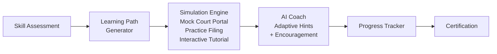

# Digital Literacy Simulator

**Train users how to use justice tech.**

## The Problem

Digital literacy gaps are massive -- and in the justice system, they're devastating. Users can't navigate court websites, miss critical filing deadlines, and make costly procedural errors because they've never had a chance to practice. For elderly litigants, rural community members, and first-time court users, the digital divide isn't just inconvenient -- it's a barrier to justice.

## The Solution

Digital Literacy Simulator provides interactive tutorials, mock court filing flows, and practice environments with an AI coach that adapts to each user's skill level. Users can make mistakes safely, build confidence, and arrive at real court portals prepared to succeed.



## Who This Helps

- **First-time court users** who have never interacted with a court system online
- **Elderly litigants** unfamiliar with digital filing and document management
- **Rural community members** with limited internet access and technology experience
- **Library digital literacy programs** seeking justice-focused training materials
- **Legal aid intake staff** who need to quickly assess and support client capabilities

## Features

- **Interactive step-by-step tutorials** that walk users through common court tasks
- **Mock court portal** for realistic practice filing without real-world consequences
- **AI coach with adaptive difficulty** -- meets users where they are and adjusts in real time
- **Progress tracking and achievement system** that keeps learners motivated
- **Librarian/facilitator dashboard** for managing group training sessions
- **Offline-capable** for community workshops with limited internet connectivity

## Getting Started

```bash
git clone https://github.com/dougdevitre/digital-literacy-sim.git
cd digital-literacy-sim
npm install
npm run dev
```

## Contributing

See [CONTRIBUTING.md](./CONTRIBUTING.md) for guidelines.

## License

MIT -- see [LICENSE](./LICENSE) for details.
