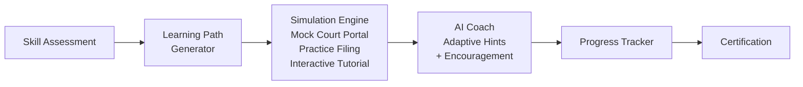

# Digital Literacy Simulator

**Train users how to use justice tech.**

## The Problem

Digital literacy gaps are massive -- and in the justice system, they're devastating. Users can't navigate court websites, miss critical filing deadlines, and make costly procedural errors because they've never had a chance to practice. For elderly litigants, rural community members, and first-time court users, the digital divide isn't just inconvenient -- it's a barrier to justice.

## The Solution

Digital Literacy Simulator provides interactive tutorials, mock court filing flows, and practice environments with an AI coach that adapts to each user's skill level. Users can make mistakes safely, build confidence, and arrive at real court portals prepared to succeed.



## Who This Helps

- **First-time court users** who have never interacted with a court system online
- **Elderly litigants** unfamiliar with digital filing and document management
- **Rural community members** with limited internet access and technology experience
- **Library digital literacy programs** seeking justice-focused training materials
- **Legal aid intake staff** who need to quickly assess and support client capabilities

## Features

- **Interactive step-by-step tutorials** that walk users through common court tasks
- **Mock court portal** for realistic practice filing without real-world consequences
- **AI coach with adaptive difficulty** -- meets users where they are and adjusts in real time
- **Progress tracking and achievement system** that keeps learners motivated
- **Librarian/facilitator dashboard** for managing group training sessions
- **Offline-capable** for community workshops with limited internet connectivity

## Quick Start

```bash
git clone https://github.com/dougdevitre/digital-literacy-sim.git
cd digital-literacy-sim
npm install
npm run dev
```

### Usage Example

```typescript
import { ScenarioEngine } from '@justice-os/digital-literacy-sim/simulation/scenario-engine';
import { AICoach } from '@justice-os/digital-literacy-sim/coach/ai-hints';

// Initialize the scenario engine
const engine = new ScenarioEngine({ maxAttempts: 5 });
await engine.loadScenarioById('small-claims-filing');
const firstStep = engine.start();

console.log(firstStep?.instruction);

// Set up AI coaching
const coach = new AICoach({ difficultyLevel: 'beginner' });

// When the user gets stuck, provide a hint
const hint = await coach.getHint('step-plaintiff-name', 1);
console.log(hint);

// Submit user action and adjust difficulty
const result = engine.submitAction('Jane Smith');
const newLevel = coach.adjustDifficulty(result.correct);
```

See [`examples/practice-filing-sim.tsx`](./examples/practice-filing-sim.tsx) for a complete React simulation component.

## Roadmap

| Feature | Status |
|---------|--------|
| Interactive step-by-step tutorials | Done |
| Mock court filing portal simulation | In Progress |
| AI coach with adaptive difficulty | In Progress |
| Progress tracking and achievement system | Planned |
| Librarian/facilitator dashboard | Planned |
| Offline-capable for community workshops | Planned |

## Architecture

See [`docs/architecture.md`](./docs/architecture.md) for detailed Mermaid diagrams covering the simulation engine, AI coach, progress tracking, and adaptive difficulty systems.

## Contributing

See [CONTRIBUTING.md](./CONTRIBUTING.md) for guidelines.

## License

MIT -- see [LICENSE](./LICENSE) for details.

---

## Justice OS Ecosystem

This repository is part of the **Justice OS** open-source ecosystem — 22 interconnected projects building the infrastructure for accessible justice technology.

### Core System Layer
| Repository | Description |
|-----------|-------------|
| [justice-os](https://github.com/dougdevitre/justice-os) | Core modular platform — the foundation |
| [justice-api-gateway](https://github.com/dougdevitre/justice-api-gateway) | Interoperability layer for courts |
| [legal-identity-layer](https://github.com/dougdevitre/legal-identity-layer) | Universal legal identity and auth |

### User Experience Layer
| Repository | Description |
|-----------|-------------|
| [justice-navigator](https://github.com/dougdevitre/justice-navigator) | Google Maps for legal problems |
| [mobile-court-access](https://github.com/dougdevitre/mobile-court-access) | Mobile-first court access kit |
| [cognitive-load-ui](https://github.com/dougdevitre/cognitive-load-ui) | Design system for stressed users |
| [multilingual-justice](https://github.com/dougdevitre/multilingual-justice) | Real-time legal translation |

### AI + Intelligence Layer
| Repository | Description |
|-----------|-------------|
| [vetted-legal-ai](https://github.com/dougdevitre/vetted-legal-ai) | RAG engine with citation validation |
| [justice-knowledge-graph](https://github.com/dougdevitre/justice-knowledge-graph) | Open data layer for laws and procedures |
| [legal-ai-guardrails](https://github.com/dougdevitre/legal-ai-guardrails) | AI safety SDK for justice use |

### Infrastructure + Trust Layer
| Repository | Description |
|-----------|-------------|
| [evidence-vault](https://github.com/dougdevitre/evidence-vault) | Privacy-first secure evidence storage |
| [court-notification-engine](https://github.com/dougdevitre/court-notification-engine) | Smart deadline and hearing alerts |
| [justice-analytics](https://github.com/dougdevitre/justice-analytics) | Bias detection and disparity dashboards |
| [evidence-timeline](https://github.com/dougdevitre/evidence-timeline) | Evidence timeline builder |

### Tools + Automation Layer
| Repository | Description |
|-----------|-------------|
| [court-doc-engine](https://github.com/dougdevitre/court-doc-engine) | TurboTax for legal filings |
| [justice-workflow-engine](https://github.com/dougdevitre/justice-workflow-engine) | Zapier for legal processes |
| [pro-se-toolkit](https://github.com/dougdevitre/pro-se-toolkit) | Self-represented litigant tools |
| [justice-score-engine](https://github.com/dougdevitre/justice-score-engine) | Access-to-justice measurement |

### Adoption Layer
| Repository | Description |
|-----------|-------------|
| [digital-literacy-sim](https://github.com/dougdevitre/digital-literacy-sim) | Digital literacy simulator |
| [legal-resource-discovery](https://github.com/dougdevitre/legal-resource-discovery) | Find the right help instantly |
| [court-simulation-sandbox](https://github.com/dougdevitre/court-simulation-sandbox) | Practice before the real thing |
| [justice-components](https://github.com/dougdevitre/justice-components) | Reusable component library |

> Built with purpose. Open by design. Justice for all.
