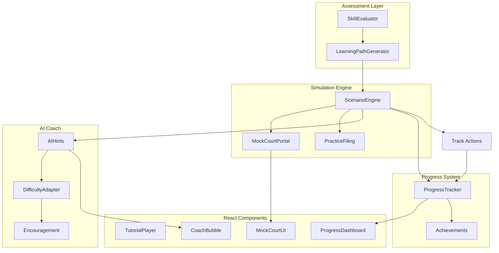
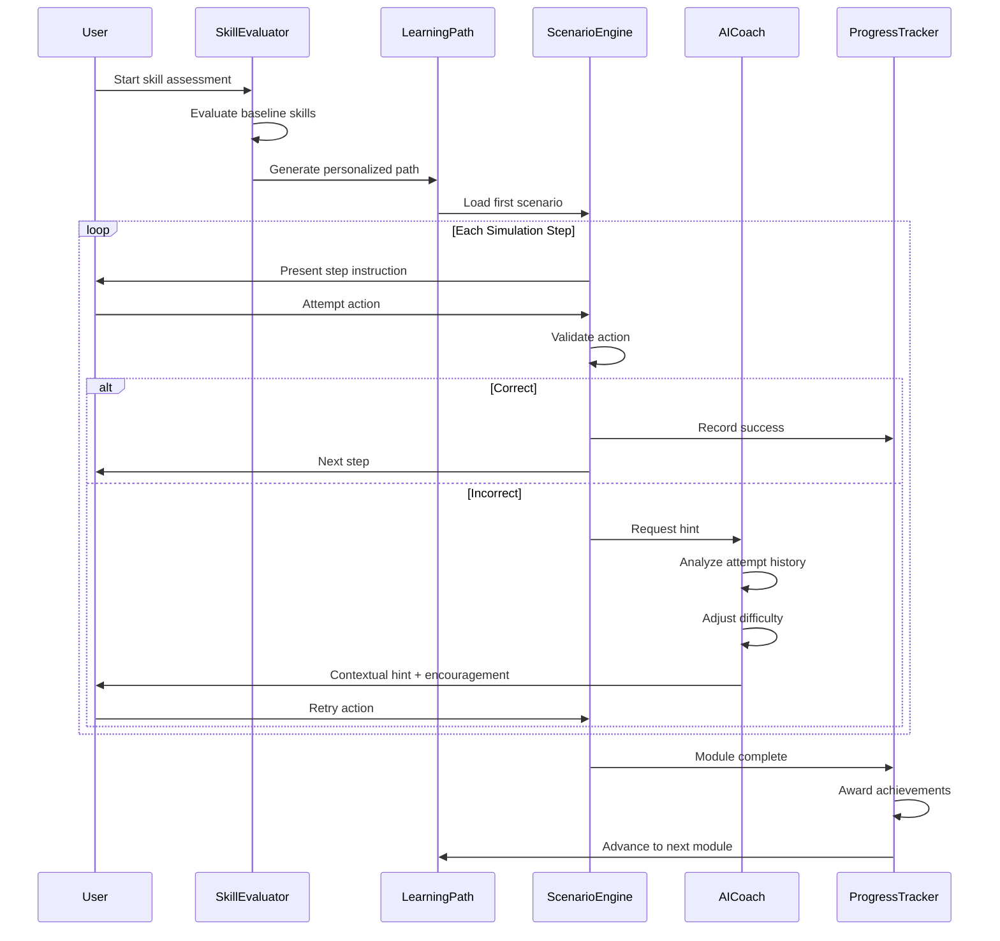
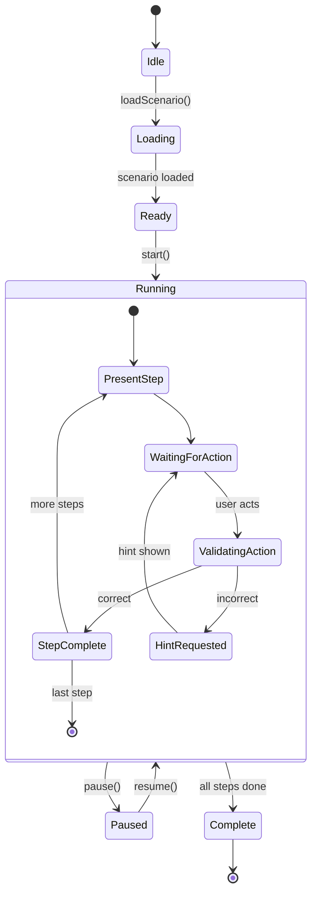
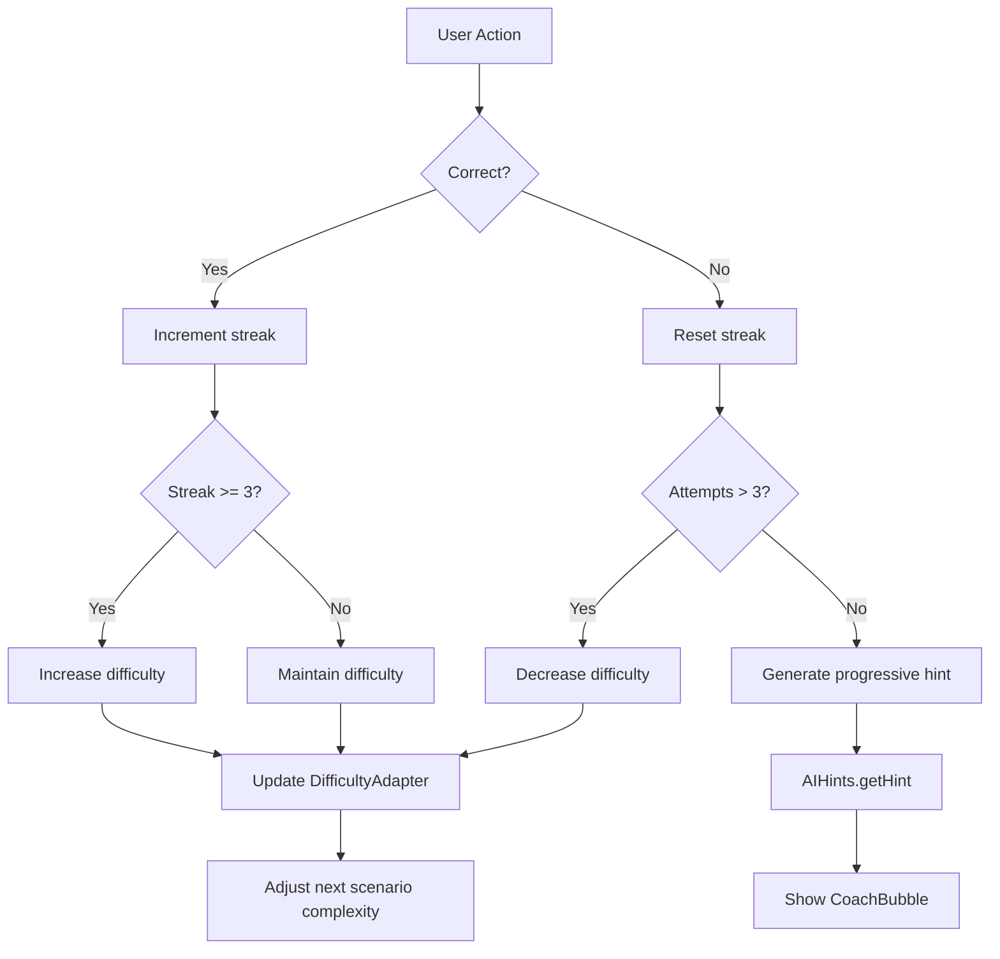
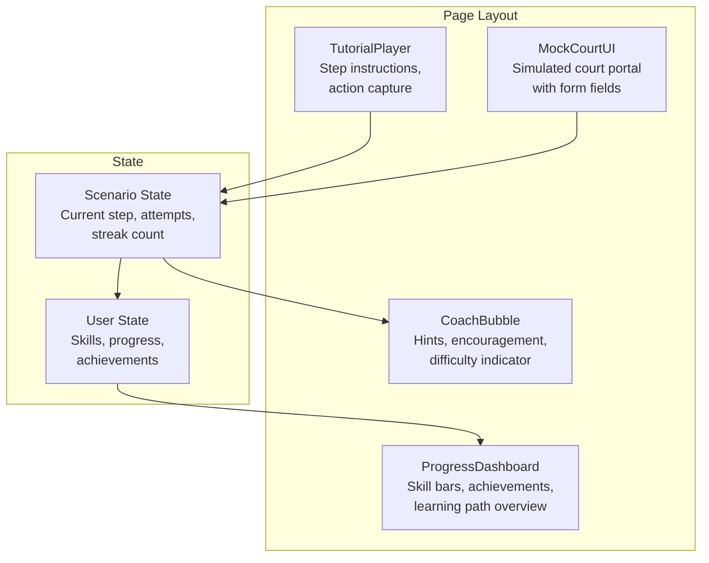

# Digital Literacy Simulator -- Architecture

## System Overview

```mermaid
graph TB
    subgraph "Assessment Layer"
        SE[SkillEvaluator]
        LP[LearningPathGenerator]
    end

    subgraph "Simulation Engine"
        SCE[ScenarioEngine]
        MCP[MockCourtPortal]
        PF[PracticeFiling]
    end

    subgraph "AI Coach"
        AH[AIHints]
        EN[Encouragement]
        DA[DifficultyAdapter]
    end

    subgraph "Progress System"
        PT[ProgressTracker]
        ACH[Achievements]
    end

    subgraph "React Components"
        TP[TutorialPlayer]
        MCU[MockCourtUI]
        CB[CoachBubble]
        PD[ProgressDashboard]
    end

    SE --> LP
    LP --> SCE
    SCE --> MCP
    SCE --> PF

    SCE --> AH
    AH --> DA
    DA --> EN

    SCE --> PT
    MCP --> MCU
    AH --> CB
    PT --> PD

    SCE --> PT_track[Track Actions]
    PT_track --> PT
    PT --> ACH
```

## Data Flow

```mermaid
sequenceDiagram
    participant User
    participant Assessment as SkillEvaluator
    participant Path as LearningPath
    participant Engine as ScenarioEngine
    participant Coach as AICoach
    participant Progress as ProgressTracker

    User->>Assessment: Start skill assessment
    Assessment->>Assessment: Evaluate baseline skills
    Assessment->>Path: Generate personalized path
    Path->>Engine: Load first scenario

    loop Each Simulation Step
        Engine->>User: Present step instruction
        User->>Engine: Attempt action
        Engine->>Engine: Validate action
        alt Correct
            Engine->>Progress: Record success
            Engine->>User: Next step
        else Incorrect
            Engine->>Coach: Request hint
            Coach->>Coach: Analyze attempt history
            Coach->>Coach: Adjust difficulty
            Coach->>User: Contextual hint + encouragement
            User->>Engine: Retry action
        end
    end

    Engine->>Progress: Module complete
    Progress->>Progress: Award achievements
    Progress->>Path: Advance to next module
```

## Simulation Engine Detail

```mermaid
stateDiagram-v2
    [*] --> Idle
    Idle --> Loading : loadScenario()
    Loading --> Ready : scenario loaded
    Ready --> Running : start()

    state Running {
        [*] --> PresentStep
        PresentStep --> WaitingForAction
        WaitingForAction --> ValidatingAction : user acts
        ValidatingAction --> StepComplete : correct
        ValidatingAction --> HintRequested : incorrect
        HintRequested --> WaitingForAction : hint shown
        StepComplete --> PresentStep : more steps
        StepComplete --> [*] : last step
    }

    Running --> Paused : pause()
    Paused --> Running : resume()
    Running --> Complete : all steps done
    Complete --> [*]
```

## AI Coach Adaptive Difficulty

```mermaid
graph TD
    A[User Action] --> B{Correct?}
    B -->|Yes| C[Increment streak]
    B -->|No| D[Reset streak]

    C --> E{Streak >= 3?}
    E -->|Yes| F[Increase difficulty]
    E -->|No| G[Maintain difficulty]

    D --> H{Attempts > 3?}
    H -->|Yes| I[Decrease difficulty]
    H -->|No| J[Generate progressive hint]

    F --> K[Update DifficultyAdapter]
    G --> K
    I --> K
    J --> L[AIHints.getHint]
    L --> M[Show CoachBubble]
    K --> N[Adjust next scenario complexity]
```

## Component Interaction

```mermaid
graph TD
    subgraph "Page Layout"
        PD[ProgressDashboard<br/>Skill bars, achievements,<br/>learning path overview]
        TP[TutorialPlayer<br/>Step instructions,<br/>action capture]
        MCU[MockCourtUI<br/>Simulated court portal<br/>with form fields]
        CB[CoachBubble<br/>Hints, encouragement,<br/>difficulty indicator]
    end

    subgraph "State"
        SS[Scenario State<br/>Current step, attempts,<br/>streak count]
        US[User State<br/>Skills, progress,<br/>achievements]
    end

    TP --> SS
    MCU --> SS
    SS --> CB
    SS --> US
    US --> PD
```
